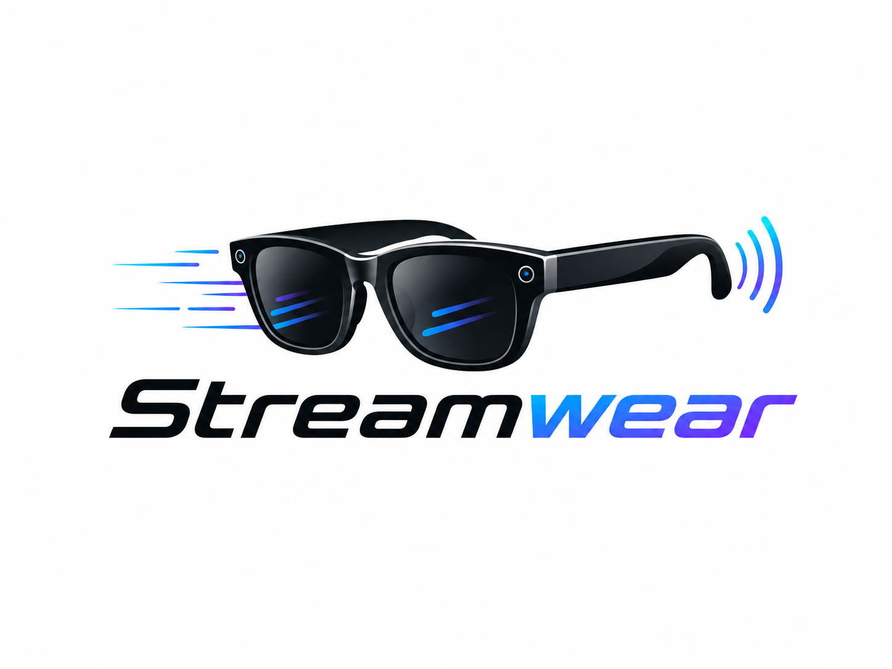

  

<h1 align="center">Streamwears</h1>

  An iOS-first livestreaming app for Meta smart glasses and iPhone cameras.

  <a href="https://streamwearsirl.com"><strong>Website</strong></a> •
  <a href="https://testflight.apple.com/join/Ee36dYF9"><strong>TestFlight</strong></a> •
  <a href="https://streamwearsirl.com/support"><strong>Support</strong></a> •
  <a href="https://streamwearsirl.com/privacy"><strong>Privacy</strong></a>

---

## What is Streamwears?

Streamwears is an iOS-focused mobile livestreaming app designed to make going live from Meta smart glasses or your iPhone camera simple.

The app is built around iPhone first. Android is not the current focus, though Android support can be explored later if needed.

## Main features

- Stream using Meta smart glasses
- Supports all Meta glasses models supported by the Meta platform
- Stream using your iPhone's front or rear camera
- Connect supported streaming platforms
- View livestream comments while live
- Switch between supported camera sources
- Simple mobile-first controls
- No complicated RTMP setup for normal use

## iPhone / iOS

Streamwears is currently available in beta through Apple TestFlight.

Our main focus is iOS because most similar Meta-glasses livestreaming tools currently target Android, while Streamwears is being built specifically for iPhone users.

**Join the iPhone beta:**
https://testflight.apple.com/join/Ee36dYF9

## Android

Android is not the current development focus.

If there is enough demand, an Android version can be developed later. For now, Streamwears is centered around delivering the best experience on iPhone.

## How it works

1. Open Streamwears.
2. Choose your Meta glasses or iPhone camera.
3. Connect the streaming platform you want to use.
4. Approve the required permissions.
5. Start your livestream.
6. Follow comments and stream status directly inside the app.

No glasses? You can still stream using your iPhone camera.

## Meta smart glasses

Streamwears is designed to work with Meta smart glasses supported by the Meta platform.

Hardware, firmware, account eligibility, Meta SDK/API changes, and third-party streaming platform changes may affect feature availability.

Streamwears is an independent application and is **not affiliated with, endorsed by, or sponsored by Meta Platforms, Inc., Ray-Ban, Twitch, or other third-party services unless specifically stated**.

## Project status

| Platform / Feature | Status |
| --- | --- |
| iOS | Beta / primary focus |
| Android | Not currently prioritized |
| Meta smart glasses | Supported |
| iPhone camera streaming | Supported |
| Public source code | Not currently published |

## Help and important links

- **Official website:** https://streamwearsirl.com
- **Apple TestFlight:** https://testflight.apple.com/join/Ee36dYF9
- **Support:** https://streamwearsirl.com/support
- **Privacy:** https://streamwearsirl.com/privacy
- **Support guide:** [SUPPORT.md](SUPPORT.md)
- **Privacy information:** [PRIVACY.md](PRIVACY.md)
- **Security reporting:** [SECURITY.md](SECURITY.md)

## Found a bug?

You can report bugs or compatibility problems through GitHub Issues or the official Streamwears support page.

When reporting a problem, it helps to include:

- Your iPhone model
- Your iOS version
- Your Meta glasses model, if you were using glasses
- Whether you were using smart glasses or the iPhone camera
- Which streaming platform you were connecting to
- A short description of what happened

Please **do not** include private credentials or secrets in a public issue.

## Security reminder

Never post any of the following publicly:

- Access tokens
- OAuth credentials
- API keys
- Stream keys
- Account passwords
- Private backend URLs or secrets

---

© 2026 Streamwears. All rights reserved.

